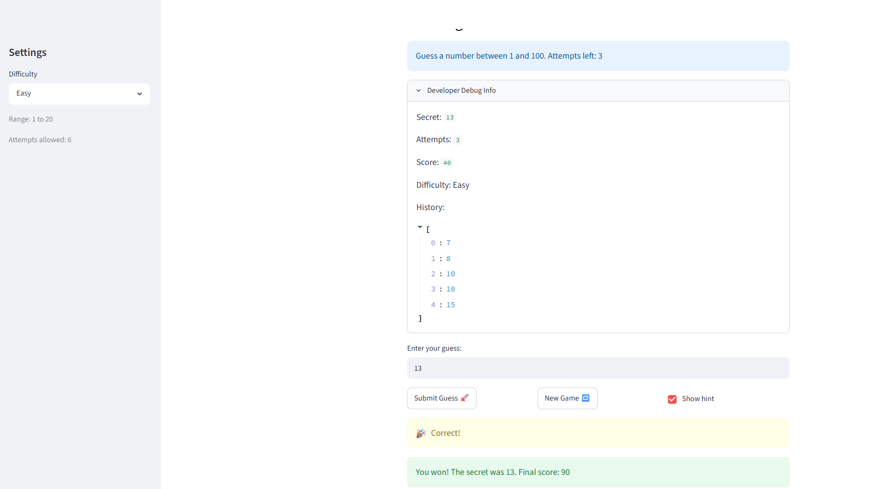

# 🎮 Game Glitch Investigator: The Impossible Guesser

## 🚨 The Situation

You asked an AI to build a simple "Number Guessing Game" using Streamlit.
It wrote the code, ran away, and now the game is unplayable. 

- You can't win.
- The hints lie to you.
- The secret number seems to have commitment issues.

## 🛠️ Setup

1. Install dependencies: `pip install -r requirements.txt`
2. Run the broken app: `python -m streamlit run app.py`

## 🕵️‍♂️ Your Mission

1. **Play the game.** Open the "Developer Debug Info" tab in the app to see the secret number. Try to win.
2. **Find the State Bug.** Why does the secret number change every time you click "Submit"? Ask ChatGPT: *"How do I keep a variable from resetting in Streamlit when I click a button?"*
3. **Fix the Logic.** The hints ("Higher/Lower") are wrong. Fix them.
4. **Refactor & Test.** - Move the logic into `logic_utils.py`.
   - Run `pytest` in your terminal.
   - Keep fixing until all tests pass!

## 📝 Document Your Experience

- [ ] Describe the game's purpose.
The game's purpose is to have the user guess the secret number within the allowed attempts. There are hints saying whether the secret number is higher or lower, and how many guesses the user has left.
- [ ] Detail which bugs you found.
The new game button wasn't working as intented, too high and too low logic was incorrect due to TypeError's, and the message itself was confusing, saying "Go Higher" when the hint also stated "Too High"
- [ ] Explain what fixes you applied.
I worked with Claude AI to fix all of the mentioned bugs above. The AI found the incorrect TypeError logic and was able to correct that by removing the statement that set the secret number to a string. Other fixes included changing where the new game button is checked, allowing new games to be started whenever, as well as fixing the game difficulties and the secret number ranges.

## 📸 Demo Walkthrough

Describe your fixed game in numbered steps so a reader can follow along without watching a video:

1. User selects Easy difficulty, changing the range of the secret number to 1-20
2. User guesses 10, and the game returns "Too Low"
3. The user wants to start again, and presses the new game button to restart.
4. The user guesses 15, and the game now returns "Too High"
5. The user starts slowly moving down, guessing 14 and seeing "Too High"
6. The user guesses 13 and sees "Too High"
7. The user guesses 12 and sees "You Win!" and the game ends.
8. The user clicks the new game button and starts again.

**Screenshot** *(optional)*: <!-- Insert a screenshot of your fixed, winning game here -->


## 🧪 Test Results

```
plugins: anyio-4.13.0
collected 18 items                                                                                                                       

tests\test_game_logic.py ...........                                                                                                              [100%]

=================================================================== 18 passed in 0.08s ===================================================================
```

## 🚀 Stretch Features

- [ ] [If you choose to complete Challenge 4, describe the Enhanced UI changes here — a screenshot is optional]
